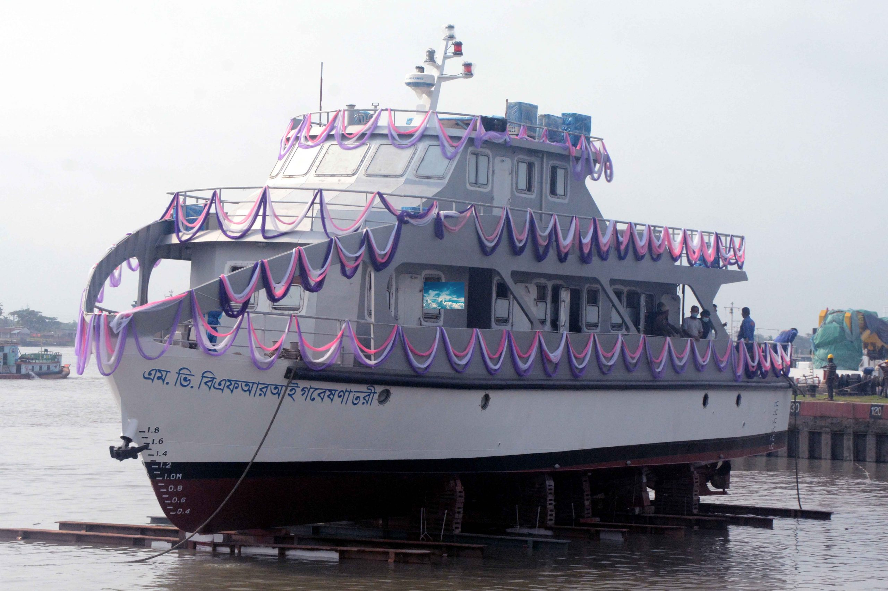

# 🛥️ Fish Research Vessel (FRV)

<p align="center">
  
</p>

<h1 align="center">Fish Research Vessel (FRV)</h1>

<p align="center">
  Designed & Constructed for <b>Bangladesh Fisheries Research Institute (BFRI)</b>
</p>

<p align="center">
  
  
  
  
  
</p>

---

## 🚢 Project Overview

The Fish Research Vessel (FRV) was developed for the **Bangladesh Fisheries Research Institute (BFRI)** to support fisheries research, marine resource assessment, fish stock monitoring, and scientific investigations.

The vessel is equipped with advanced fish-finding technology and a dedicated onboard research laboratory for conducting fisheries and environmental studies.

---

## 📐 Principal Particulars

| Particular           | Specification                          |
| -------------------- | -------------------------------------- |
| Length Overall (LOA) | 25.0 m                                 |
| Breadth (Moulded)    | 6.0 m                                  |
| Depth (Moulded)      | 2.8 m                                  |
| Draft                | 1.4 m                                  |
| Maximum Speed        | 10 Knots                               |
| Special Feature      | Fish Finder & Fish Research Laboratory |

---

## 📋 Contract Information

| Item            | Details                                        |
| --------------- | ---------------------------------------------- |
| Client          | Bangladesh Fisheries Research Institute (BFRI) |
| Classification  | Department of Shipping (DOS)                   |
| Contract Signed | 13 May 2019                                    |
| Delivery        | 30 September 2021 (Extended)                   |

---

## ⚙️ Major Machinery & Equipment

### Main Propulsion System

| Item                  | Specification |
| --------------------- | ------------- |
| Main Engine Brand     | Yanmar        |
| Origin                | Japan         |
| Quantity              | 2 Sets        |
| Power                 | 2 × 255 HP    |
| Total Installed Power | 510 HP        |

### Electrical Power Generation

| Item            | Specification   |
| --------------- | --------------- |
| Generator Brand | Beta Marine Ltd |
| Origin          | United Kingdom  |
| Quantity        | 1 Set           |
| Capacity        | 37 KVA          |

---

## 🔬 Research Capabilities

* Fish stock assessment
* Fisheries resource monitoring
* Marine biological sampling
* Environmental data collection
* Fish finder-assisted survey operations
* Onboard laboratory research
* Coastal and inland fisheries studies

---

## 👨‍💼 My Role

### Project Coordinator | Naval Architect

#### Responsibilities

* Project planning and execution
* Design review and technical coordination
* Naval architectural support
* Procurement coordination
* Quality control and inspection
* Client communication and stakeholder management
* Construction monitoring
* Delivery and commissioning support

---

## 🏆 Project Highlights

✅ Research Vessel for National Fisheries Development

✅ Integrated Fish Finder System

✅ Fully Equipped Research Laboratory

✅ Twin Engine Propulsion System

✅ DOS Class Compliance

✅ Successfully Delivered to BFRI

---

## 📊 Technical Summary

```text
Length Overall (LOA) : 25.0 m
Breadth (Mld.)       : 6.0 m
Depth (Mld.)         : 2.8 m
Draft                : 1.4 m
Maximum Speed        : 10 Knots

Main Engines         : 2 × 255 HP Yanmar (Japan)
Generator            : 1 × 37 KVA Beta Marine Ltd (UK)

Class                : Department of Shipping (DOS)
Client               : Bangladesh Fisheries Research Institute (BFRI)

Contract Signed      : 13 May 2019
Delivery             : 30 September 2021
```

---

## 📸 Project Launch

This vessel was successfully launched and delivered for operational deployment, contributing to Bangladesh's fisheries research and marine resource development initiatives.

<p align="center">
  
</p>

---

### Status

# ✅ PROJECT COMPLETED & DELIVERED
